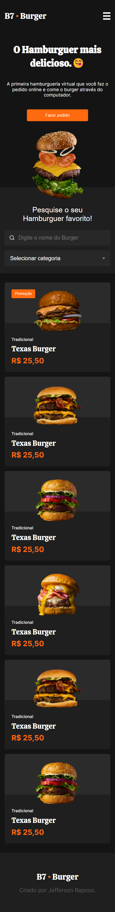
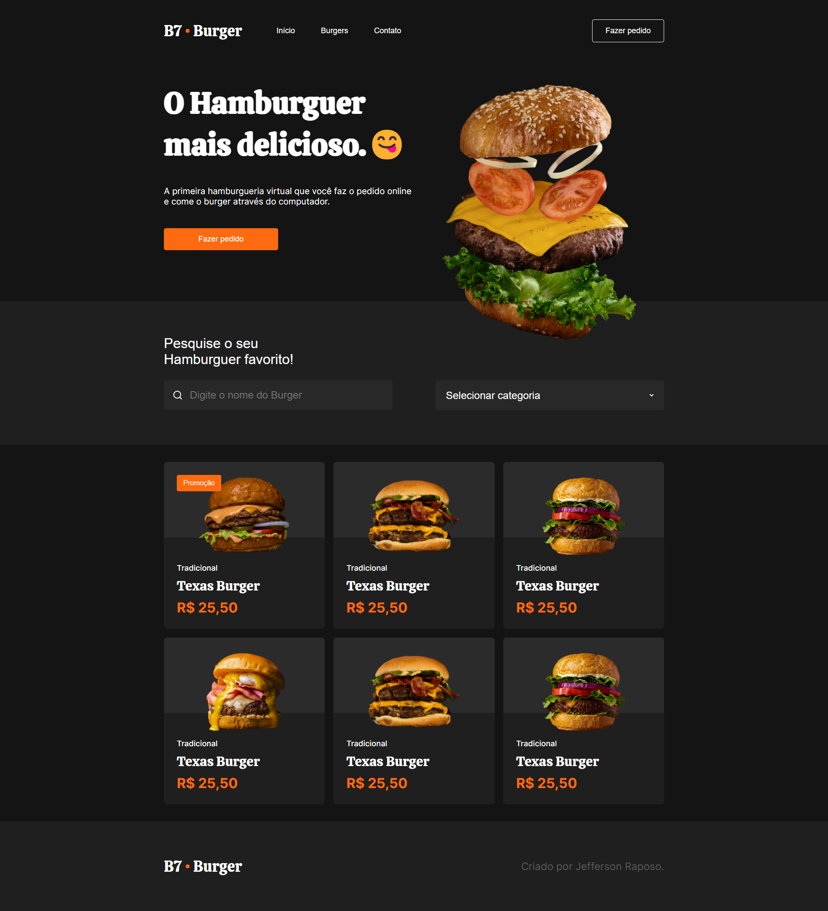

##
<h1 align="center">Projeto B7 Burger</h1>

	

 <a href="#💻-sobre-o-projeto">Sobre</a> •
 <a href="#🎨-layout">Layout</a> • 
 <a href="#🛠-tecnologias">Tecnologias</a> • 
 <a href="#🧙‍♂️-autor">Autor</a> 

## 💻 Sobre o projeto

📄 Esse é um projeto de uma landing page com foco no aprendizado das tecnologias HTML e CSS.

Projeto desenvolvido durante o **Curso de HTML e CSS** oferecido [B7 Web](https://lp.b7web.com.br/).

---

## 🎨 Layout

Abaixo segue layout do projeto.

### Mobile

  

---

### Web

  
  

---

## 🛠 Tecnologias

As seguintes ferramentas foram usadas na construção do projeto:

-   **HTML**
-   **CSS**

## 🧙‍♂️ Autor

Feito com ❤️ por Jefferson Raposo 👋🏽 [Entre em contato!](https://www.linkedin.com/in/jefferson-raposo/)

---

